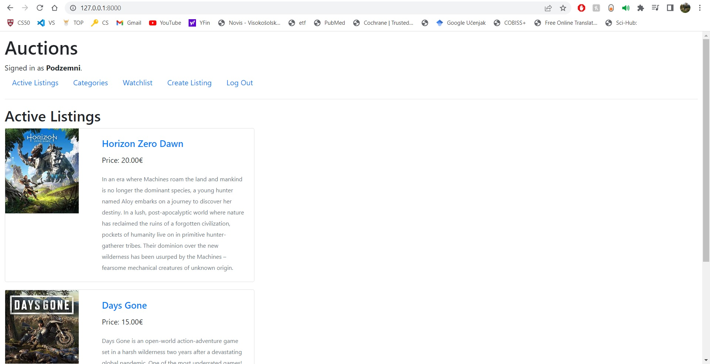
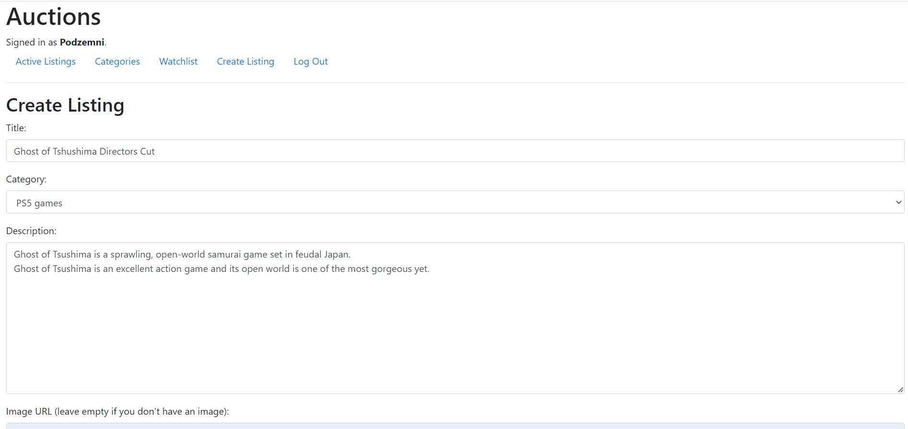

# Commerce site project

As a part of **CS50W** programm, we had to build a commerce webapp using Django framework. 
I designed an eBay-like e-commerce auction site that will allow users to post auction listings, place bids on listings, comment on those listings, 
and add listings to a “watchlist.”

The page is a commerce site for selling used videogames. 

## Index page

## Create listing page

## Entry page

