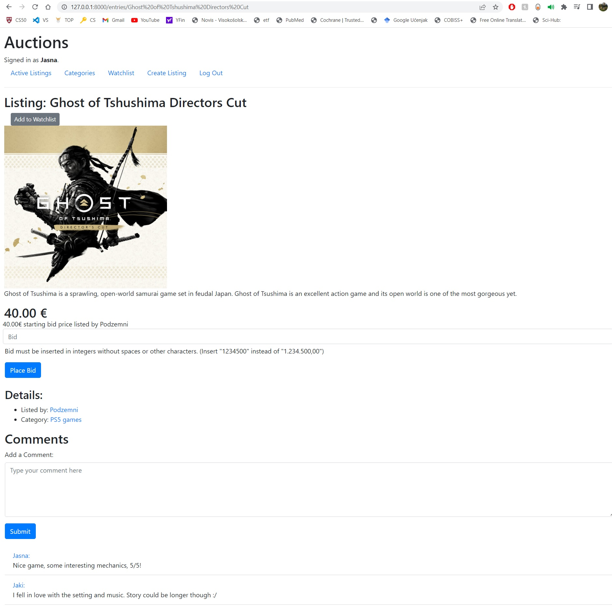

# Commerce site project

As a part of **CS50W** program, I had to build a commerce webapp using Django framework. 
I have completed the implementation of an eBay-like e-commerce auction site, which allows users to post auction listings, place bids on listings, comment on those listings, and add listings to a "watchlist."

## Index page
The default route of the web application displays a list of all currently active auction listings, which includes the title, description, current price, and image of each listing.

## Create listing page
Users can create new listings by visiting a page with a form for specifying the title, description, starting bid, and optional image URL and category of the listing. When the form is submitted, a new auction listing is created and added to the database.

## Entry page
Clicking on a listing takes the user to a page specific to that listing, where they can view all details about the listing, including the current price. If the user is signed in, they can add the item to their watchlist or place a bid on the item. If the user is the one who created the listing, they can close the auction from this page, which makes the highest bidder the winner of the auction and makes the listing no longer active. If a user is signed in on a closed listing page and has won the auction, the page displays a message indicating this. Users who are signed in can also add comments to the listing page, which are displayed along with any other comments made on the listing.

Users who are signed in can visit their watchlist page, which displays a list of all the listings they have added to their watchlist. Clicking on any of these listings takes the user to that listing's page.

The site also includes a page that displays a list of all listing categories, and clicking on the name of any category takes the user to a page that displays all of the active listings in that category.

Finally, the site includes a Django admin interface that allows a site administrator to view, add, edit, and delete any listings, comments, and bids made on the site.

Overall, I believe I have successfully implemented all the required features for the auction site, and it is now a fully functional e-commerce web application.
